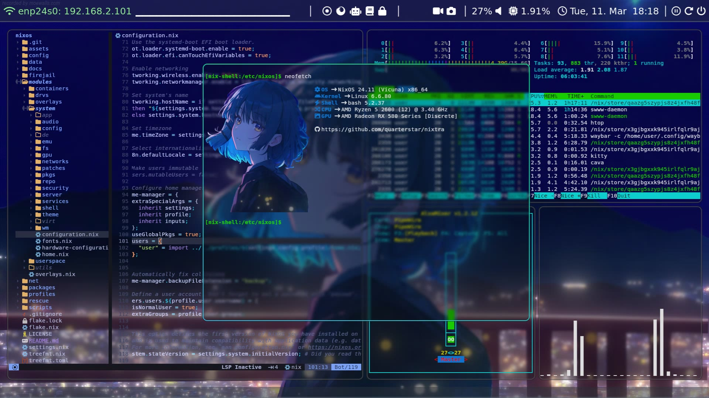

 
 
 <h2>⚡ Your Supercharged NixOS Config</h2>

## ❓ About Project

Nixtra is a fully-featured, hardened and extensible that focuses on anonymity, privacy and security. It is designed to:

- Provide an ideal environment for: gaming; programming; the use of multimedia applications; security analysis and virtualization.
- Give the ability to switch between different profiles in within a single user, each designated a different role, to prevent distractions and straighten my workflow.
- Harden the security of any system and implement sane defaults for opsec.
- Be easily understandable, customizable and extensible by other NixOS users interested in the use and/or further development of the configuration.
- Patch out the weird quirks that come with using NixOS on personal computers.
- Make NixOS easier to use and customize.

## 📚 Table of Contents

- [Features](##features)
- [Security Considerations](##security_considerations)
- [Security Features](##security_practices)
- [User Accounts](##user)
- [Profiles Accounts](##profiles)
- [Configuration](##configuration)
- [Default Profiles](##default)
- [Project Structure](##project)
- [See Also](##see)
- [Credits](##credits)

## ⭐ Features

- Pre-installed, beautifully-riced window managers and desktop environments. (Currently Hyprland; more in the future.)
- Different flavors of profiles pre-configured with a variety of packages to fullfill your needs.
- A, lot, and I mean a **LOT** of pre-baked fixes for common NixOS issues and annoyances. (For example, you do not need to `git add` a file when rebuilding with Flakes so that it registers it.)
- High-level configuration system.

## 🔒 Security Features

Some example security features (which can be toggled on or off) Nixtra employs are:

- [Tor browsing uses a unique flavor-based system with separate Tor browsers.](./docs/01-usage.md##)
- All permitted insecure packages may only be used under a profile with no networking enabled.
- `rm` is replaced with an alias of `trash` to prevent accidental permanent file deletion and many other aliases are included.
- Untrusted applications are encapsulated by a firejail wrapper to restrict their scope and permissions.
- Clipboard's buffer is cleared 10 seconds after being written, regardless of the application modifying it or the data being pasted.
- A set of sensitive applications like Tor Browser is pre-configured to automatically close upon the PC receiving a suspend signal.
- Sound access is disabled for Tor Browser and other sensitive applications.
- Certain software like Git are configured to route all traffic through Tor for anonymity.
- Many core components utilities (like gnu coreutils) are replaced with mature Rust-written equivalents which patch out many security vulnerabilities often found in C programs, without breaking userspace.
- Features like commits in Git use a randomized date to make it harder to pinpoint someone's timezone.
- ...and more

For a complete list and elaboration for the above, view [SECURITY.md](SECURITY.md).

## 🖊️ Security Considerations

- Do NOT set your password or secrets in NixOS modules! Nix generates `.drv` files after building which may contain the password, allowing anyone to view it worldwide. Instead, either use SOPS or provide secrets to programs imperatively.

## 🖥️ Installed Software

Nixtra is bundled with software for:

- Programming
- Web Development
- Security Researching
- Penetration Testing
- Reverse Engineering
- Gaming
- Virtualization
- Multimedia Applications
- Social Media Applications
- ...and more

All software provided by the mainstream Nixtra repository must strictly be free and open source software. Popular software packages and configurations for proprietary applications can exist but are to be commented out.

## 👤 User Accounts

The Nixtra environment is intended to be used as a single-user system. A default `user` account configuration is provided. However, the user may pick a profile based on their software needs.

Also, additional users may be defined in the `security.extraUsers` attribute provided in `settings.nix`. These users only exist for the sole purpose of storing secret documents and files that should not be accessible to programs that are run under the main `user`.

## ♦️ Profiles

Nixtra is a single-user NixOS configuration, but the user may have multiple profiles. Profiles dictate what software shall be installed on your system, as well as how they shall be configured. For instance, you can have a personal profile, a work profile and a gaming profile each equipped with different or shared pieces of software.

Nixtra provides the following default profiles:

| Profile     | Dependencies | Purpose
| ----------- | ------------ | -------
| `personal`  | `*`          | superset of all software available to profiles.
| `program`   | `math`       | subset of software needed to program + all math profile software.
| `exploit`   | -            | subset of software needed for vulnerability exploitation and analysis.
| `math`      | -            | subset of all software needed to study math.
| `untrusted` | -            | minimal profile that provides only absolutely necessary cli tools.

## ⚙️ Configuration

Nixtra configuration comes in two flavors:

- `settings.nix`: Root system-level configuration dictating your hardware specifications and such. Shared amongst all profiles. Located at `settings.nix`.
- `profile-settings.nix`: Profile-specific user-level configuration. Located at `profiles/$PROFILE/profile-settings.nix`.

For more information, refer to the [configuration page](./docs/02-configuration.md).

## 🚧 Project Structure

- `profiles`: configuration for the [profiles mechanism](./docs/02-configuration.md).
- `config`: non-nix configurations for applications. [Read More](./docs/01-configuration.md)
- `firejail`: configuration files for [hardening user and system applications](./docs/03-hardening.md) with firejail.
- `modules/system`: all system-level services, applications and configurations.
- `modules/userspace`: all the installed userspace applications and configurations.

## ⚓ See Also

- [My easy-to-use framework for building hardened, customizable and extensible NixOS routers](https://github.com/quarterstar/nixter)
- [My notes for NixOS and computer science -related topics](https://github.com/quarterstar/notes)

## 🔗 Credits

All of the works below have been altered, modified or kept in their original state respectively for their successful and seamless integration into Nixtra's environment:

- [Wallpaper](https://steamcommunity.com/sharedfiles/filedetails/?id=3323190978)
- [Startup Sound Effect](https://pixabay.com/sound-effects/soft-startup-sound-269291)
- [Firejail Overlay](https://github.com/stelcodes/nixos-config/blob/main/packages/overlay.nix)
- [Waybar Record Module](https://gist.github.com/raffaem/bb9c35c6aab663efd7a0400c33d248a1)

## 📜 License

All Nixtra code included in this repository is licensed under the terms of the [GNU Affero General Public License](LICENSE). Further, all text including, but not limited to:

- Documentation in the `./docs` directory;
- GitHub Wiki entries; and
- GitHub Pages associated with Nixtra

are licensed under [CC-BY-NC-SA 4.0](https://creativecommons.org/licenses/by-nc-sa/4.0/deed.en), unless otherwise stated explicitly by the respective author of the software and text.
