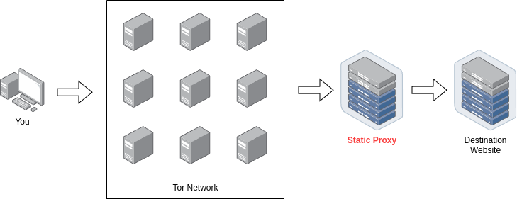

# Nixtra - Usage

Congratulations on installing Nixtra! To get you fully settled in, below you will find information about general usage of your new system. Please refer to the corresponding section for your selected window manager, desktop manager or other environment.

## Table of Contents

- [Commands](##commands)
- [Applications](##applications)
- [Keybindings](##keybindings)

## Commands

Nixtra provides a set of custom commands to make managing NixOS easy. Below are the most important ones:

- `nixtra-rebuild`: Rebuild the system according to its configuration in `/etc/nixos`.
- `nixtra-update`: Update your system and its dependencies.
- `nixtra-clean`: General system cleanup; clean up logs, Nix store, Nix cache, etc.
- `nixtra-record`: Start a video recording of the entire screen or a region.
- `nixtra-screenshot`: Take a screenshot of the entire screen or a region.
- `nixtra-create-iso`: Generate an ISO file based on your Nixtra configuration.
- `nixtra-fix-bootloader`: Automatically troubleshoot and fix the bootloader, if it breaks and your system does not boot.
- `nixtra-regen-hardware`: Regenerate the configuration describing the hardware used by the system; graphics card, mount points etc.

You can find more of them by checking for commands with the following prefixes:

- `nix-`: Commands related to the Nix package manager.
- `nixos-`: Commands related to the Nix Operating System (NixOS).
- `nixtra-`: Commands related to the Nixtra configuration for NixOS.

## Applications

### Tor Browser

In Nixtra, Tor Browser is provided in three different flavors, each used for different scenarios. These can be located in the taskbar of the selected window manager or desktop environment of your choice, as shown with the corresponding icons below:

** Clearnet Tor Browser**

This flavor disables the built-in Tor routing and instead acts like a normal browser, without any sort of proxy. This means that you cannot access .onion hidden services with this flavor.

This flavor is ideal if you want simple browsing with privacy but not the anonymity that regular Tor provides.

** Proxy Tor Browser**

This flavor replaces the built-in Tor proxy to use a chain of proxies. The first proxy in the chain is the Tor service, which is functionally equivalent to the regular Tor Browser. However, the second proxy in the chain is a public proxy of your choice, which is right after the exit node. The chain of proxies looks like this:

The purpose of this flavor is to mask the exit node's IP address so that websites that block Tor do not know you are using Tor. Unlike Tor bridges, which bypass censorship by putting a private proxy in between you and the guard (entry) node, this flavor provides a proxy in between the exit node and the destination website.

This is ideal if you want to log into websites like Reddit, which bans any Tor users that it detects having an exit node IP address. The usage of this flavor should ideally be restricted to ONLY your online identity, as any other website that sees the public proxy in the back of the exit node will be able to associate your activity and hence with your online account(s).

** Regular Tor Browser**

This flavor is simply the regular Tor browser with a regular Tor connection, ideal for most anonymous activities. Unless otherwise specified in its connection settings, no additional proxy will be used.

## Keybindings

> [!IMPORTANT]
> All window managers and desktop environments are configured to adhere to the standard shortcuts used by Nixtra, listed below respectively. If you are using a modified version of Nixtra, these may not apply.

### Window Manager

- `SUPER WHEEL`: Switch to next or previous workspace.
- `SUPER SHIFT V`: Cycle through clipboard history.
- `SUPER SHIFT S`: Take a screenshot of a specific region of the window. (Stored in `~/Pictures/Screenshots`)
- `SUPER SHIFT R`: Start/stop recording a specific region of the window. (Stored in `~/Videos/Screencasts`)
- `SUPER S`: Take a screenshot of the entire window. (Stored in `~/Pictures/Screenshots`)
- `SUPER R`: Start/stop recording the entire window. (Stored in `~/Videos/Screencasts`)
- `ALT J`: Switch from vertical tiling to horizontal or vice versa for active window.
- `ALT F`: Toggle fullscreen.
- `ALT Q`: Create new window.
- `ALT Z`: Close active window.
- `ALT M`: Log out of active user.
- `ALT F<0->`: Switch workspace.
- `ALT V`: Toggle floating window mode.
- Arrow keys: Move focus to any neighbor window.

> [!NOTE]
> `SUPER` is the Windows key on most keyboards.

### Desktop Environment

Nixtra does not yet support any desktop environment.
